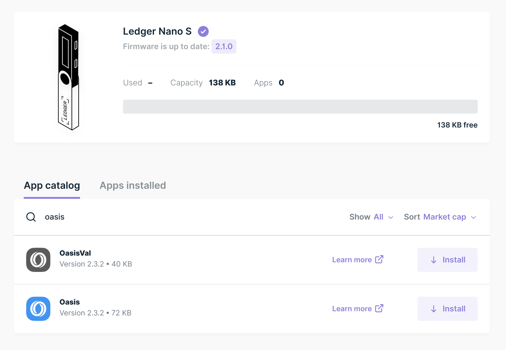

# Setup


Oasis Core Ledger is currently only supported on x86_64 Linux and macOS systems.


## Prerequisites

### Oasis Core Ledger CLI

There are no special requirements for running the Oasis Core Ledger CLI.

### Ledger Signer Plugin

You will need an appropriate version Oasis Node CLI installed your system.

For more details, see the [Oasis Node] documentation in the general
[Oasis Docs].


Currently, there are no binary releases of the Oasis Node CLI for macOS systems.

To be able to use the Ledger signer plugin on a macOS system, you will need to
[build the Oasis Node CLI from source].


[Oasis Node]:
  https://docs.oasis.dev/general/run-a-node/prerequisites/oasis-node
[Oasis Docs]:
  https://docs.oasis.dev/
<!-- markdownlint-disable line-length -->
[build the Oasis Node CLI from source]:
  https://docs.oasis.dev/general/run-a-node/prerequisites/oasis-node#building-from-source
<!-- markdownlint-enable line-length -->

## Downloading a Binary Release

Go to [Oasis Core Ledger's GitHub Releases page] and download the latest
version.

[Oasis Core Ledger's GitHub Releases page]:
  https://github.com/oasisprotocol/oasis-core-ledger/releases

## Building From Source

_TODO: Link to Development docs once they exist._

## Adding `oasis-core-ledger` Binary to `PATH`

To install the `oasis-core-ledger` binary for the current user, copy/symlink it
to `~/.local/bin`.

To install the `oasis-core-ledger` binary for all users of the system, copy it
to `/usr/local/bin`.

## Remembering Path to `ledger-signer` Plugin

For convenience, set the `LEDGER_SIGNER_PATH` to the location of the
`ledger-signer` binary, e.g.:

```bash
LEDGER_SIGNER_PATH="$HOME/oasis_core_ledger_1.0.0_linux_amd64/ledger-signer"
```

## Installing Oasis App on Your Ledger Wallet

The recommended way to install the [Oasis app] on your Ledger wallet is to
install it via [Ledger Live]'s Manager.


Currently, you will have enable _Developer mode_ by going to
_Settings -> Experimental features_, to be able to find the Oasis app in
Ledger Live's Manager.



The Oasis app requires an up-to-date firmware on your Ledger wallet:

- At least [version 1.6.1] released on Aug 11, 2020 on a Nano S device.
- At least [version 1.2.4-4] released on Aug 4, 2020 on a Nano X device.

Follow Ledger's instructions for updating the firmware on your Ledger wallet:

- [Nano S]
- [Nano X]



To find the Oasis app in the Ledger Live app store, go to the App catalog
search bar and type in _Oasis_.

You may see both the _Oasis_ app and the _OasisVal_ app come up in the search
results. You need to use the standard _Oasis_ app.




Once installed, the Oasis app will use the generated mnemonic stored on the
Ledger wallet to generate the private & public key pairs for your accounts.

<!-- markdownlint-disable line-length -->
[Oasis app]: https://github.com/Zondax/ledger-oasis
[Ledger Live]: https://www.ledger.com/ledger-live/
[version 1.6.1]:
  https://support.ledger.com/hc/en-us/articles/360010446000-Ledger-Nano-S-firmware-release-notes
[version 1.2.4-4]:
  https://support.ledger.com/hc/en-us/articles/360014980580-Ledger-Nano-X-firmware-release-notes
[Nano S]:
  https://support.ledger.com/hc/en-us/articles/360002731113-Update-Ledger-Nano-S-firmware
[Nano X]:
  https://support.ledger.com/hc/en-us/articles/360013349800
<!-- markdownlint-enable line-length -->
